```python
# Imports
import networkx as nx
import numpy as np
import matplotlib.pyplot as plt
import random
import pydot
from IPython.display import Image
```


```python
# Of use later
start_token = "START_TOKEN"
end_token = "END_TOKEN"
seperator = " && "
```


```python
def viz_connections ( conn ):
    
    # Graph itselt
    G=nx.MultiDiGraph(directed=True)
    
    # Add connections
    for _from, _to in conn:  
        G.add_edge(_from, _to )
        
    # Draw it out
    p=nx.drawing.nx_pydot.to_pydot(G)
    p.write_png('./out.png')
    return Image(filename='./out.png') 
```


```python
# Simply example with two edges
viz_connections([
    (1,2), (2,3)
])
```


    
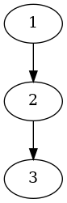
    


```python
# Or other way with multiple paths
viz_connections([
    (1,'x'), (1,'y'), ('x',2), ('y', 2)
])
```


    
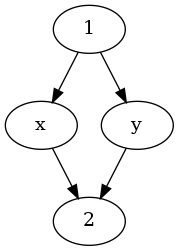
    


```python
# Generate connections from a series sequences
def n_gramify ( lines, n_grams = 1):
    
    connections = []
    for line in lines:
    
        # add edges to sequence
        v = [start_token, *line.split(' '), end_token]
        size = len(v)
        
        for i in range( size ):
        
            # look back and forward up to 'n_gram' number
            for n_back in range(1, n_grams+1 ):
                for n_forward in range(1, n_grams+1 ):

                    back = i-n_back
                    forw = i+n_forward

                    if back < 0 or forw > size: continue
                    if back == 0 and i != 1: continue
                    if forw == size and n_forward != 1: continue

                    # Add the connection
                    connections.append(( 
                        seperator.join( v[back:i] ), 
                        seperator.join(v[i:forw])
                    ))
                    
    
    return connections
```


```python
# Simple 1-gram aproach
_ = n_gramify( ["1 2 3 4 5"], n_grams = 1 )
_
```


    [('START_TOKEN', '1'),
     ('1', '2'),
     ('2', '3'),
     ('3', '4'),
     ('4', '5'),
     ('5', 'END_TOKEN')]


```python
viz_connections( _ )
```


    
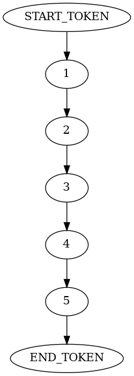
    


```python
# Or with optional 2-grams
_ = n_gramify( ["1 2 3 4"], n_grams = 2 )
_
```


    [('START_TOKEN', '1'),
     ('START_TOKEN', '1 && 2'),
     ('1', '2'),
     ('1', '2 && 3'),
     ('2', '3'),
     ('2', '3 && 4'),
     ('1 && 2', '3'),
     ('1 && 2', '3 && 4'),
     ('3', '4'),
     ('2 && 3', '4'),
     ('4', 'END_TOKEN'),
     ('3 && 4', 'END_TOKEN')]


```python
viz_connections( _ )
```


    
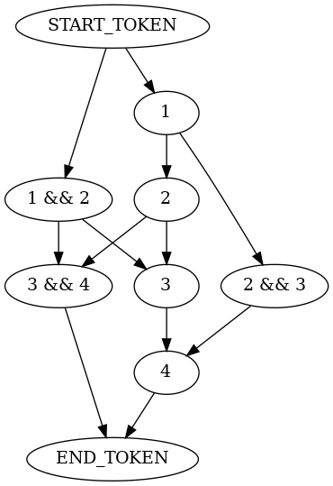
    


```python
# Or with optional 3-grams
# Becomes messy really quickly
viz_connections( 
    n_gramify( ["1 2 3 4 5 6"], n_grams = 3 ) 
)
```


    
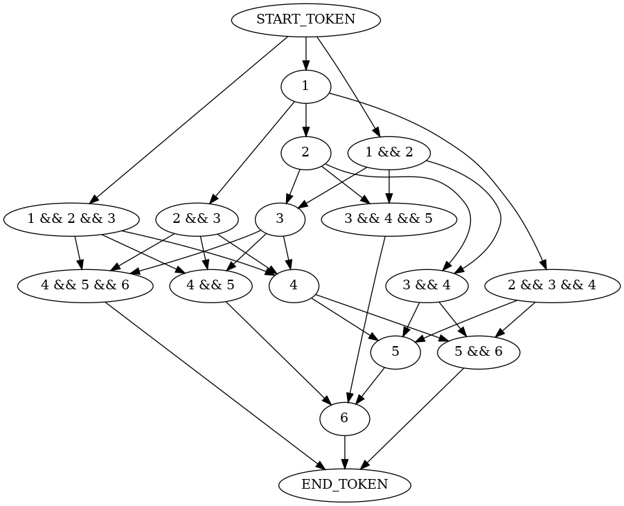
    


```python
# But this can be applied to text!
viz_connections( 
    n_gramify( [
        "The cat ate a bird",
        "The mouse ate some cheese"
    ], n_grams = 1 ) 
)
```


    
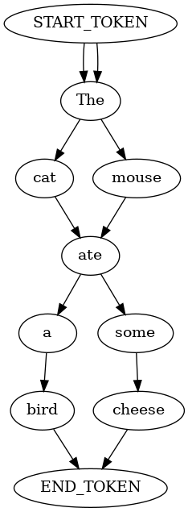
    


```python
# And it becomes quite complicated quite quickly
viz_connections( 
    n_gramify( [
        "The cat ate a bird",
        "The mouse ate some cheese"
    ], n_grams = 2 ) 
)
```


    
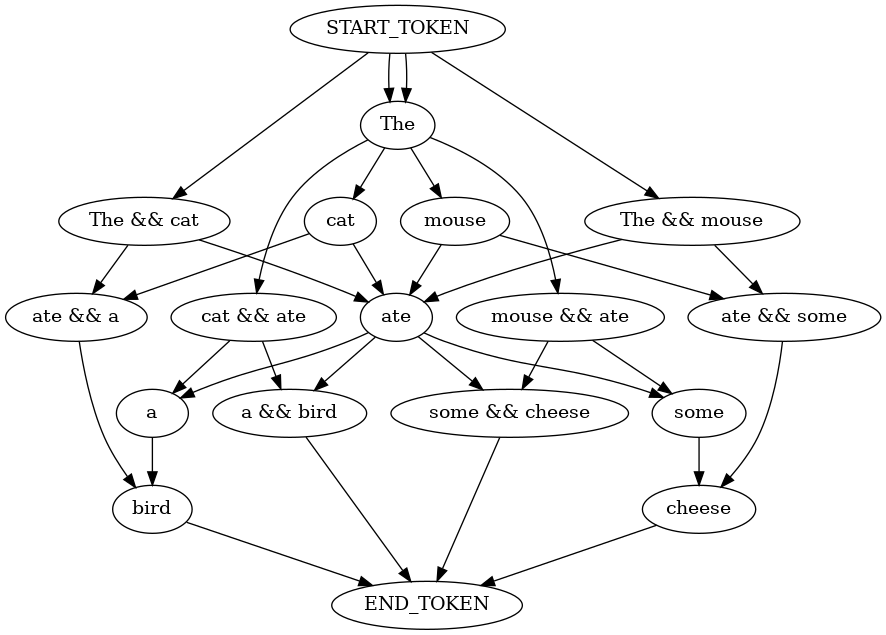
    


```python
# To apply it to a block of text
# Generate a model from a series of connections
def n_graphify ( lines, n_gram ):
    
    states = {}
    connections = n_gramify( lines, n_grams = n_gram )
    
    for conn in connections:
        
        _from, _to = conn
        
        # Update the dictionary if needed
        if not (_from in states):
            states[_from] = { "total" : 0, "weights" : {} }
        if not ( _to in states[_from]["weights"]):
            states[_from]["weights"][_to] = 0

        # add in the weight
        states[_from]["total"] += 1
        states[_from]["weights"][_to] += 1

    return states
```


```python
# Turn that sequence into a probability model
n_graphify( ["1 2 3 4 5"], 1 )
```


    {'START_TOKEN': {'total': 1, 'weights': {'1': 1}},
     '1': {'total': 1, 'weights': {'2': 1}},
     '2': {'total': 1, 'weights': {'3': 1}},
     '3': {'total': 1, 'weights': {'4': 1}},
     '4': {'total': 1, 'weights': {'5': 1}},
     '5': {'total': 1, 'weights': {'END_TOKEN': 1}}}


```python
# Takes in a model and produces a sequence out of it
def sim_model ( model ):
    
    last_state = start_token
    states = []
    
    while True:
        
        # Compute weighted average over connections
        total = model[last_state]["total"]
        rand = random.randint( 0, total ) # 2
        
        for key in model[last_state]["weights"]:
            
            v = model[last_state]["weights"][key]
            rand -= v
            
            if ( end_token in key ):
                return states
            
            # Select given key for this connection
            if ( rand <= 0 ):
                states.append(key)
                break
        
        last_state = states[-1]
        
    return states
        
```


```python
# Simple model is ... well, simple
model = n_graphify( ["1 2 3 4 5"], 2 )
path = sim_model( model )
path
```


    ['1', '2 && 3', '4', '5']


```python
# Visualize the given model path output
def viz_connection_path ( model, path = False):
    
    # Edges 
    if not path: path = sim_model( model )
    _path = [start_token, *path, end_token]
    edges = [ (_path[i],_path[i+1]) for i in range(len(_path)-1) ]
    
    # Graph itselt
    G=nx.MultiDiGraph(directed=True)

    # Color code them
    for _from in model:
        for _to in model[_from]["weights"]:
            if ( _from, _to ) in edges:
                G.add_edge(_from, _to , color="red" )
            else:
                G.add_edge(_from, _to )
    
    # Draw it out
    p=nx.drawing.nx_pydot.to_pydot(G)
    p.write_png('./out.png')
    return Image(filename='./out.png') 
```


```python
# But we can see which path the model took through the chart now
viz_connection_path( model, path )
```


    
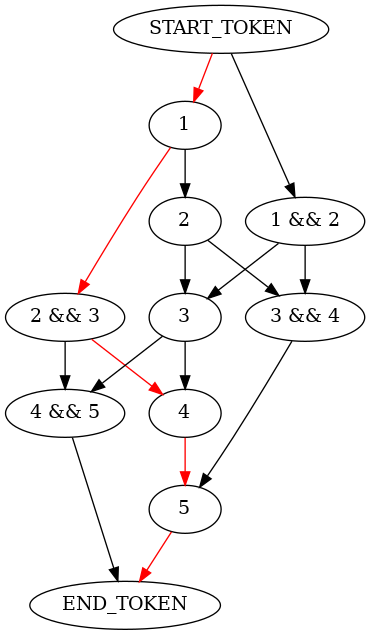
    


```python
# With more complex models it becomes interesting
# Plotint out 4 of them for effect
display(*[
    viz_connection_path( 
        n_graphify( [
            "The cat ate a bird at dinner",
            "The mouse ate some cheese at night",
            "The person ate burnt toast at dawn"
        ], 2 ) 
    ) for i in range(4)
])
```


    
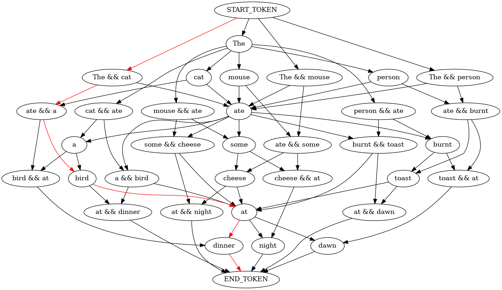
    


    
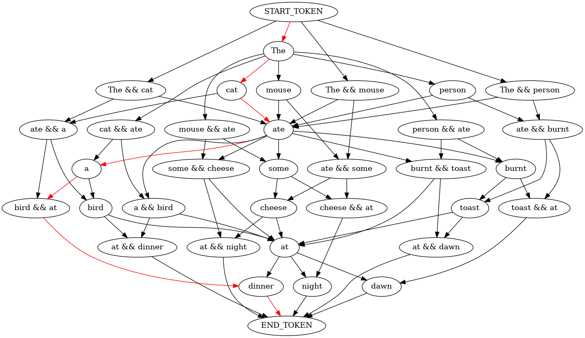
    


    
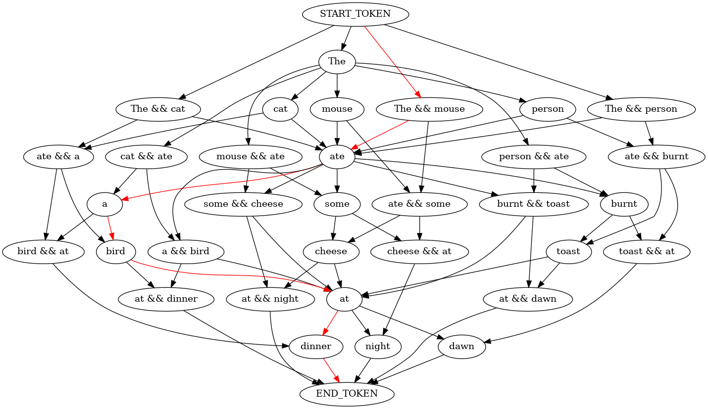
    


    
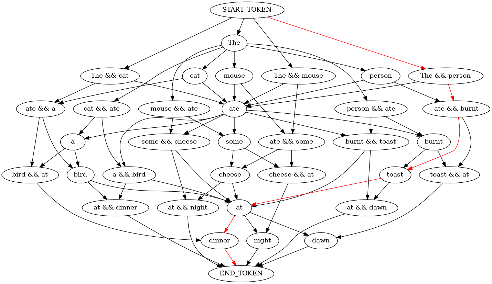
    


```python
# We can then apply it to much larger texts!
lines = open("frankenstien.txt", "r").readlines()
```


```python
# Generate a graph like the one above, but for the entire book ( not printing out this one )
model = n_graphify( lines, 4 )
```


```python
# for a bit better print outs
def clean_gen ( conn ):
    result = ""
    out = sim_model( conn )
    for i in out:
        result += ' ' + i.replace(seperator, " ")
    return result
```


```python
# Generate a sentence given the graph of the book
# this sentence is a new sentence, not in the book, but basted off of the original text
clean_gen( model )
```


    ' “The old man paused and that I could with difficulty sit upright in it. No wood, however, was placed on the earth, from which all men fled and whom all men disowned?\n'


```python
# It doesnt exactly make sence, but its gramaticly valid!
```
